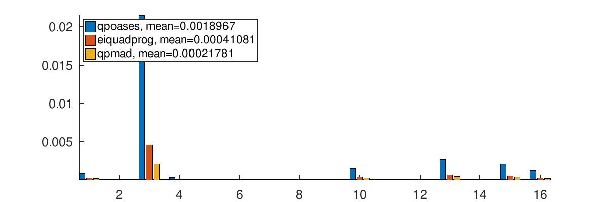
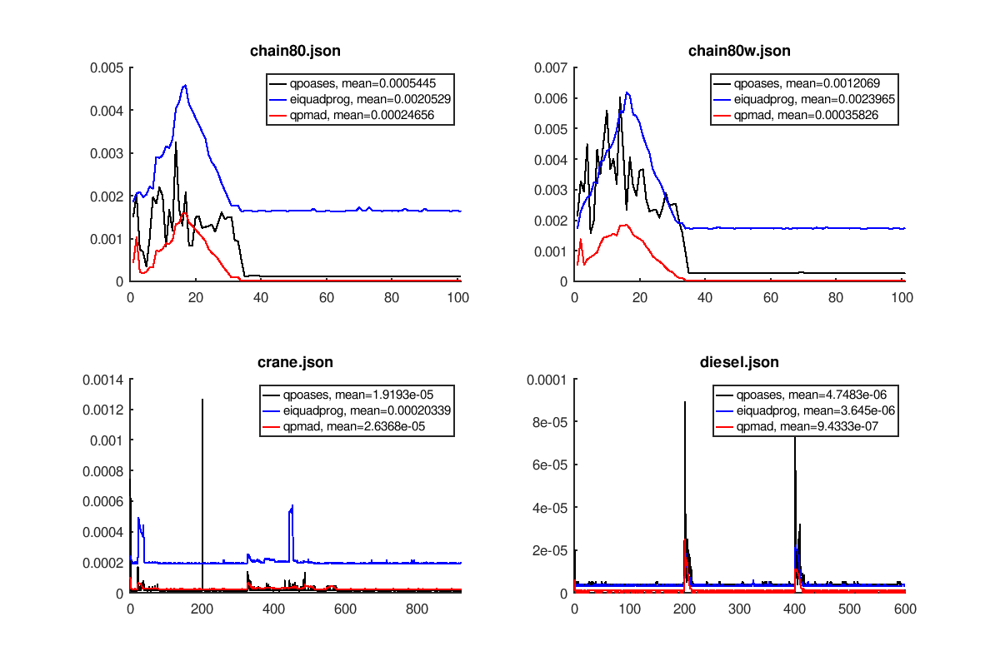

Comparative benchmark of QP solvers
===================================

Solvers:
--------

- `qpmad` -> https://github.com/asherikov/qpmad
- `qpOASES` -> https://github.com/coin-or/qpOASES
- `eiquadprog-fast` -> https://github.com/stack-of-tasks/eiquadprog

Results
-------

- All problems are dense and positive-definite.
- `qpOASES` is used with MPC option preset, this gives ~50% performance boost
  compared to default preset.
- Time measurements include only the time required to solve a problem; other
  operations, such as initialization of the solver or reshaping of the
  constraints, are not taken into account.

### oneshot (`qpOASES`)

- The problem set includes 'standalone' problems distributed with qpOASES ->
  https://github.com/coin-or/qpOASES/tree/misc/testingdata/cpp/problems,
  positive-semidefinite problems are skipped.

- Hotstarting is not used.

Time (second) required to solve each of the problems:

The same plot with logarithmic scale:

### iterative (`qpOASES`)

- The problem set includes MPC problems distributed with qpOASES ->
  https://github.com/coin-or/qpOASES/tree/misc/testingdata/cpp/oqp, all of them
  have constant Hessian and varying constraints.

- `qpOASES` is hotstarted starting from the second problem in the sequence,
  factorization of the Hessian is reused by `qpmad` in the same way.

* `eiQuadProg` does not produce the exact answer (up to 1e-9 precision) on some
  of the problems.

Plots correspond to specific MPC problems and demonstrate time (second) taken
by the solvers on each MPC iteration:

